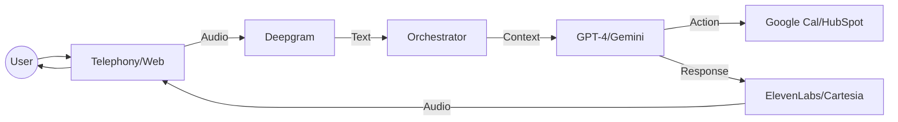

# Sharyx OS 🎙️

**The Open-Source Framework for Building Production-Grade Real-Time AI Voice Agents.**

Sharyx OS is an orchestration engine that connects Speech-to-Text (STT), Large Language Models (LLM), and Text-to-Speech (TTS) into a seamless, low-latency conversation loop.

[](https://www.npmjs.com/package/sharyx-os)
[](https://opensource.org/licenses/MIT)

---

## 🚀 Key Features

- **⚡ Low Latency**: Optimized streaming architectures for near-instant responses.
- **🔄 Recursive Tool Calling**: Enable your agents to search, book, and act in real-time.
- **🔌 Provider Agnostic**: Swap between OpenAI, Gemini, Deepgram, ElevenLabs, and more with one line of code.
- **📞 Multi-Channel**: Native support for Twilio, Plivo, and WebRTC.
- **🧠 Persistent Memory**: Redis-backed session management for stateful conversations.

---

## 📦 Quick Start

### 1. Install

```bash
npm install sharyx-os
```

### 2. Create your first agent

```typescript
import { createAgent, OpenAILLM, DeepgramSTT, ElevenLabsTTS } from 'sharyx-os';

const agent = createAgent({
  stt: new DeepgramSTT({ apiKey: process.env.DEEPGRAM_API_KEY }),
  llm: new OpenAILLM({ apiKey: process.env.OPENAI_API_KEY }),
  tts: new ElevenLabsTTS({ apiKey: process.env.ELEVEN_LABS_API_KEY }),
  systemPrompt: "You are a helpful assistant for a medical clinic."
});

agent.start({ port: 3000 });
```

---

## 🧩 Architecture



---

## 🛠️ Included Integrations

- **CRM**: HubSpot Lead Capture.
- **Calendar**: Google Calendar Appointment Booking.
- **Messaging**: WhatsApp Cloud API Notifications.

---

## 🛠️ Setup & Installation

### 1. Clone the Project
```bash
git clone https://github.com/sharyx-repo/sharyx-os.git
cd sharyx-os
```

### 2. Install Dependencies
You need to install dependencies for the specific example you want to run:

**For Telephony (Twilio/Plivo):**
```bash
cd examples/telephony
npm install
```

**For Web-Call (Browser Streaming):**
```bash
cd examples/web-call
npm install
```

### 3. Configure Environment Variables
Each example folder contains a `.env.example` file.
1. Rename it to `.env`.
2. Add your API keys (Deepgram, Groq/OpenAI, Cartesia, etc.).

### 4. Run the Application
```bash
npm run start
```

> [!TIP]
> **If the call disconnects immediately:**
> - Ensure **ngrok** is running and configured correctly.
> - The application port (e.g., 3000) must match the port you are tunneling with ngrok.
> - Verify your webhook URLs in Twilio/Plivo match your ngrok domain.

---

## 🗺️ Roadmap & Community

We are building the future of voice-first interfaces. Want to help?
- Check out [CONTRIBUTING.md](./CONTRIBUTING.md) to add new providers.
- Join our [Discord](https://discord.gg/sharyx) (Coming Soon).

---

## 📄 License

This project is licensed under the **MIT License**.
